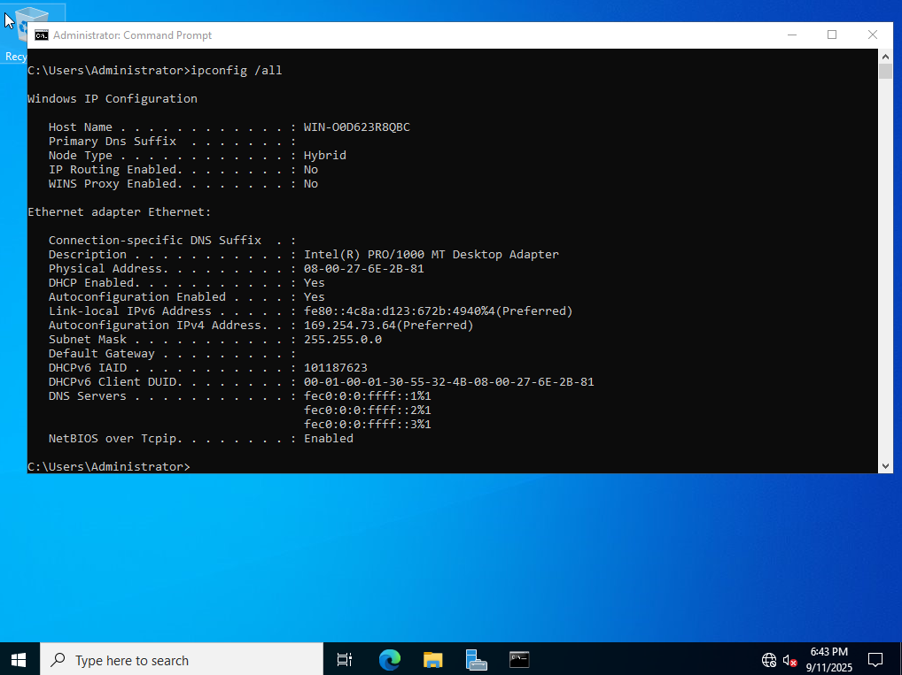
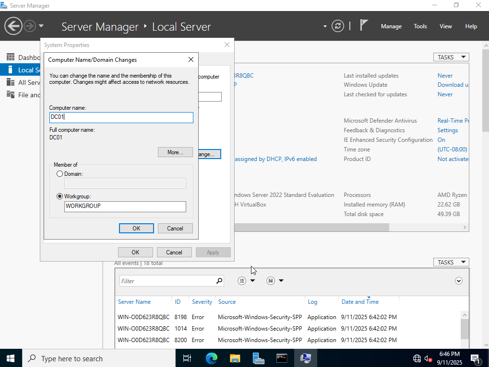

# Active Directory

This project provides a basic step-by-step walkthrough setting up an Active Directory (AD) environment with Windows Server 2022 and Windows 10 clients. The goal of this Lab is to understand domain controller setups, DNS, DHCP, Organisational Units (OUs), user and group management, authentication, and Group Policy Objects (GPOs).

---

## 🧮 AD Overview

### What is Active Directory?  
**Active Directory (AD)** is a directory service developed by Microsoft that enables secure access to resources in a networked Windows environment. Primarily used for **authentication** and **authorisation**, AD allows IT admins to manage **users**, **computers**, and **resources** from a centralised location.

### Why is Active Directory Used?  
AD simplifies the intimidating task of managing hundreds or thousands of users, computers, printers, servers, and devices manually through:
- Centralised management of users, groups, and computers
- Enhanced security through access controls and authentication policies
- Scaling to businesses of all sizes with multiple domains and sites
- Integrating directly with Microsoft 365, Azure, and other enterprise tools

### Key Components
1. **Domain Controller (DC)**: acting as the central authority for user and device access - the server that stores the AD database and handles authentication requests
2. **Objects**: containing Users, Computers, Groups (collection of users with shared permissions), and Organisational Units (OUs - containers for organising objects)
3. **Forests**: highest level in an AD hierarchy that contains one or more domains
4. **Trees**: collection of related domains within a forest
5. **Domain**: logical grouping of AD objects under a single domain name (e.g., example.com)
6. **Group Policy**: tools to centrally enforce security settings and configurations, used to apply password policies, desktop settings, and software installations across multiple computers and users
7. **Lightweight Directory Access Protocol (LDAP)**: protocol used to access and manage information stored in AD
8. **Kerberos Authentication**: secure method used to authenticate users and devices in a network

---

## 🛠 Tools & Technologies Used
- VM Manager: Oracle VirtualBox
- Windows Server 2022 ISO
- Windows 10 ISO
- Active Directory Domain Services (AD DS)
- DNS / DHCP Server
- Group Policy Management Console (GPMC)
- PowerShell

---

## 🔧 Topology
- Domain Name: bane.com
- Server Name: DC01
   - OS: Windows Server 2022
   - Role: AD DS, DNS, DHCP
   - Static IP: `192.168.0.1/24`  
- Client Name: PC01
   - OS: Windows 10
   - DHCP Enabled  
- Server Name: DC02
   - OS: Windows Server 2022
   - Role: AD DS, DNS, DHCP
   - Static IP: `192.168.1.1/24`  

---

## 🚀 Walkthrough

### Step 1: Doing the first thing

Description of the step.  
Here’s what you should see:

---

### Step 2: Next configuration

Description…

---

### Step 3: Another step

…

---

## 🎯 Key Takeaways

- Point 1  
- Point 2  
- Point 3
